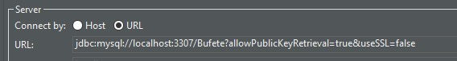

# AYD2_Practica_G12

Connect to DB using DBeaver


jdbc:mysql://localhost:3307/Bufete?allowPublicKeyRetrieval=true&useSSL=false

Create Network before Running Docker-compose up --build 
```bash
docker network create AyD2-Network
Docker-compose up --build 
```
## Manual para iniciar el proyecto

### Levantar el docker la base de datos de MySQL

```bash
AYD2_Practica_G12$ docker compose up
```

### Levantar el servidor

```powershell
AYD2_Practica_G12/Backend$  npm install
AYD2_Practica_G12/Backend$  npm run dev

```

### Levantar el Frontend
```powershell
AYD2_Practica_G12/Frontend$  npm install
AYD2_Practica_G12/Frontend$  npm run dev

```